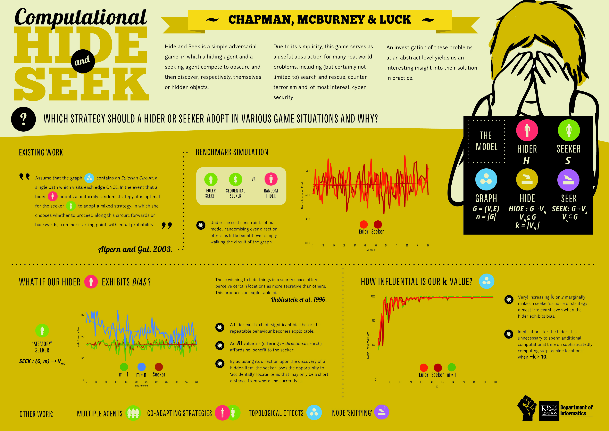

# Hide-and-Seek (HANDS)

A plugin for the JGraphT library facilitating the running of Search Game (Hide-and-Seek) simulations.

Cite as _[Cyber Hide-and-Seek](https://kclpure.kcl.ac.uk/portal/files/65641336/2016_Chapman_Martin_David_1156145_ethesis.pdf). Chapman, Martin. 2016._

### Crude running instructions

`cd <repo path>`

`AWT_FORCE_HEADFUL=true /Library/Java/JavaVirtualMachines/jdk1.8.0_25.jdk/Contents/Home/bin/java -XX:-UseGCOverheadLimit -Xmx5g -Dfile.encoding=US-ASCII -classpath <repo path>/bin:<repo path>/lib/epsgraphics.jar:<repo path>/lib/jcommon-1.0.21.jar:<repo path>/lib/jfreechart-1.0.17.jar:<repo path>/lib/jgrapht-core-0.9.0.jar:<repo path>/lib/jgraph-sna.jar:<repo path>/lib/java-plot.jar:<repo path>/lib/commons-math3-3.4.1.jar:<repo path>/lib/commons-math3-3.4.1.jar:<repo path>/lib/bsh-2.0b4.jar Utility.Runner`

or

`cd <repo path>`

`AWT_FORCE_HEADFUL=true /Library/Java/JavaVirtualMachines/jdk1.8.0_25.jdk/Contents/Home/bin/java -XX:-UseGCOverheadLimit -Xmx5g -Dfile.encoding=US-ASCII -classpath <repo path>/bin:<repo path>/lib/epsgraphics.jar:<repo path>/lib/jcommon-1.0.21.jar:<repo path>/lib/jfreechart-1.0.17.jar:<repo path>/lib/jgrapht-core-0.9.0.jar:<repo path>/lib/jgraph-sna.jar:<repo path>/lib/java-plot.jar:<repo path>/lib/commons-math3-3.4.1.jar:<repo path>/lib/bsh-2.0b4.jar Utility.Runner`

or

`AWT_FORCE_HEADFUL=true /Library/Java/JavaVirtualMachines/jdk1.8.0_25.jdk/Contents/Home/bin/java -XX:-UseGCOverheadLimit -Xmx5g -Dfile.encoding=US-ASCII -classpath <repo path>/bin:<repo path>/lib/epsgraphics.jar:<repo path>/lib/jcommon-1.0.21.jar:<repo path>/lib/jfreechart-1.0.17.jar:<repo path>/lib/jgrapht-core-0.9.0.jar:<repo path>/lib/jgraph-sna.jar:<repo path>/lib/java-plot.jar:<repo path>/lib/commons-math3-3.4.1.jar:<repo path>/lib/bsh-2.0b4.jar Utility.Runner`
